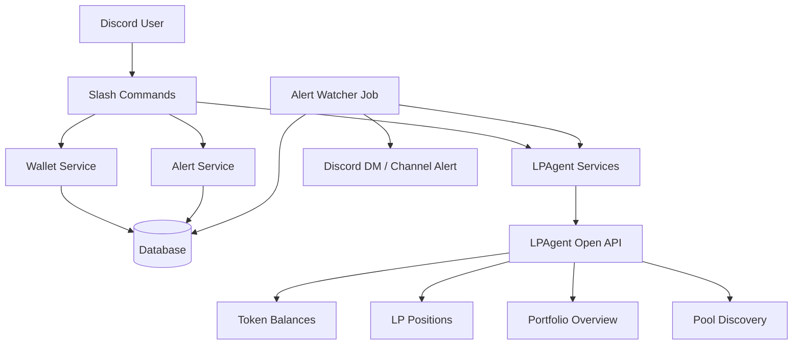

# LPAgent Discord Bot MVP Codebase Structure

This document sketches the first version of a Discord bot for community members to monitor and manage LPAgent liquidity provider activity. The MVP should stay read-only plus alerts first, with zap-in and zap-out execution added later after a secure wallet-signing flow exists.

## Goals

- Let each Discord user configure their own wallet address.
- Show token balances, open LP positions, portfolio overview, pool discovery, and pool details.
- Support basic alert rules for position health and performance.
- Avoid collecting private keys or signing transactions directly inside Discord.

## Suggested Project Tree

```txt
lpagent-discord/
├─ src/
│  ├─ bot.ts
│  ├─ config/
│  │  └─ env.ts
│  │
│  ├─ commands/
│  │  ├─ wallet.ts        # /wallet connect, status, unlink
│  │  ├─ balance.ts       # /balance
│  │  ├─ positions.ts     # /positions
│  │  ├─ portfolio.ts     # /portfolio
│  │  ├─ pools.ts         # /pools
│  │  ├─ pool.ts          # /pool <address>
│  │  └─ alerts.ts        # /alert add/list/remove
│  │
│  ├─ interactions/
│  │  ├─ buttons.ts       # Position buttons, pagination, alert actions
│  │  └─ embeds.ts        # Shared Discord embed builders
│  │
│  ├─ services/
│  │  ├─ lpagent/
│  │  │  ├─ client.ts     # x-api-key fetch wrapper
│  │  │  ├─ token.ts      # Balance API
│  │  │  ├─ positions.ts  # Opening, historical, overview, logs
│  │  │  └─ pools.ts      # Discover, info, stats
│  │  │
│  │  ├─ walletService.ts # Discord user -> wallet config
│  │  ├─ alertService.ts  # Alert rules and checks
│  │  └─ formatter.ts     # Numbers, USD, SOL, percentages
│  │
│  ├─ jobs/
│  │  └─ alertWatcher.ts  # Periodic polling for PnL/range/fee alerts
│  │
│  ├─ db/
│  │  ├─ schema.ts
│  │  ├─ client.ts
│  │  └─ migrations/
│  │
│  ├─ types/
│  │  ├─ lpagent.ts
│  │  └─ discord.ts
│  │
│  └─ utils/
│     ├─ logger.ts
│     ├─ errors.ts
│     └─ validation.ts
│
├─ package.json
├─ tsconfig.json
├─ .env.example
└─ README.md
```

## MVP Architecture



## Database Tables

```txt
users
- id
- discord_user_id
- wallet_address
- created_at
- updated_at

alerts
- id
- user_id
- type              # out_of_range, pnl_above, pnl_below, fee_above
- position_id
- threshold_value
- enabled
- created_at

alert_events
- id
- alert_id
- triggered_at
- message
```

## MVP Command Set

```txt
/wallet connect <address>
/wallet status
/wallet unlink

/balance
/positions
/portfolio

/pools search:<token> sort:<tvl|vol_24h|fee_tvl_ratio>
/pool <poolAddress>

/alert add position:<id> type:<pnl_below|pnl_above|out_of_range|fee_above>
/alert list
/alert remove <id>
```

## LPAgent API Mapping

| Feature              | Endpoint                                                                          |
| -------------------- | --------------------------------------------------------------------------------- |
| Wallet balances      | `GET /token/balance?owner=<wallet>`                                               |
| Open LP positions    | `GET /lp-positions/opening?owner=<wallet>`                                        |
| Portfolio overview   | `GET /lp-positions/overview?owner=<wallet>`                                       |
| Historical positions | `GET /lp-positions/historical?owner=<wallet>`                                     |
| Position logs        | `GET /lp-positions/logs?owner=<wallet>` or `GET /lp-positions/logs?position=<id>` |
| Pool discovery       | `GET /pools/discover`                                                             |
| Pool detail          | `GET /pools/{poolId}/info`                                                        |
| Pool stats           | `GET /pools/{poolId}/onchain-stats`                                               |
| Top LPers            | `GET /pools/{poolId}/top-lpers`                                                   |

## Later Trading Flow

Zap-in and zap-out should be added only after a secure signing UX exists.

```txt
Zap-In:
1. Discover pool
2. Fetch pool info and active bin
3. Generate unsigned transactions with POST /pools/{poolId}/add-tx
4. User signs in wallet
5. Submit signed transactions with POST /pools/landing-add-tx

Zap-Out:
1. Fetch open positions
2. Preview output with POST /position/decrease-quotes
3. Generate unsigned transactions with POST /position/decrease-tx
4. User signs in wallet
5. Submit signed transactions with POST /position/landing-decrease-tx
```

## Security Notes

- Never ask users to paste private keys or seed phrases into Discord.
- Store only public wallet addresses for the MVP.
- Keep the LPAgent API key server-side only.
- Use ephemeral Discord responses for wallet configuration and position actions.
- Require explicit user confirmation before adding any future transaction execution.
